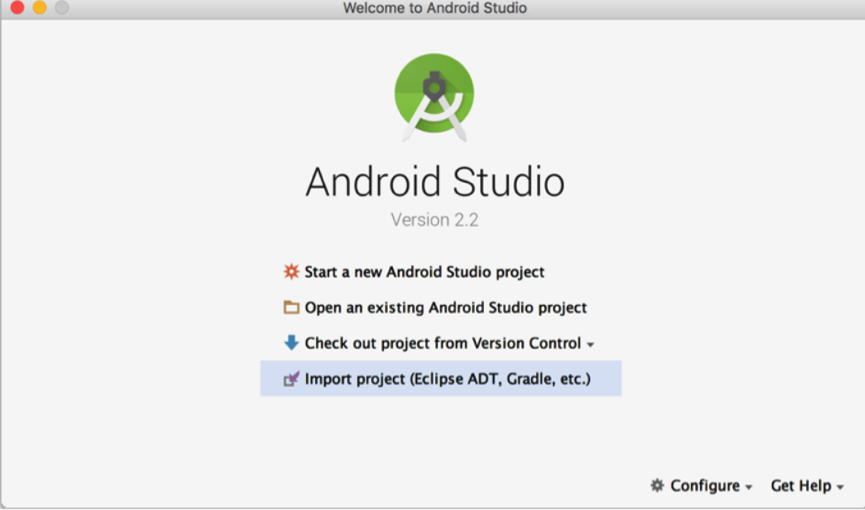
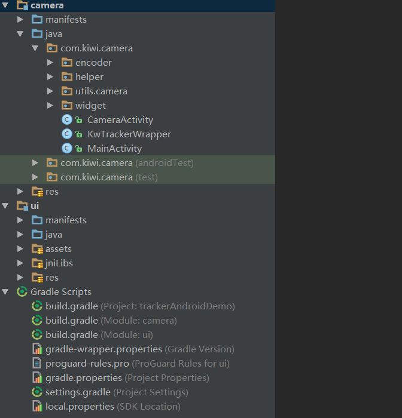
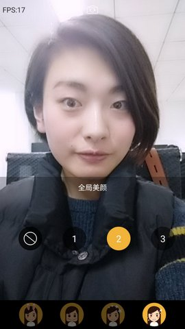
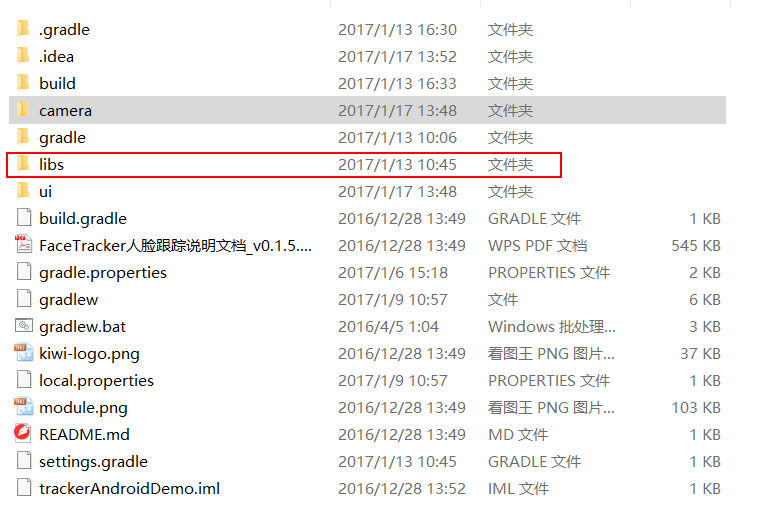

# Kiwi人脸跟踪SDK快速集成指南

kiwi人脸跟踪SDK，主要功能包括：
- 静态图片的人脸以及关键点位置检测
- 68个人脸关键点的实时检测与跟踪（单人脸/多人脸）
- 美颜、哈哈镜等实时滤镜功能
- 人脸Pose参数估计
- 趣味2D贴纸

我们的SDK针对移动端，在算法效率、硬件占用、性能精度等方面进行了相关优化，使其适用于移动端直播，美颜相机，滤镜相机，趣味贴纸，虚拟美妆等应用场景。

## 流程图


这个文档将演示如何利用我们的demo快速入门，并详细描述具体集成步骤。

## Demo快速入门
#### 准备环境

开发软件

    * Android SDK API Level> = 15
    * Android Studio 2.0 或以上版本

硬件

    * 支持语音和视频功能的真机
    * Android 4.1或以上设备

#### 编译代码示例
1. 在Android Studio里选择 Import project (Eclipse ADT, Gradle, etc.)
   

2. 利用Android studio的导入功能导入以下项目
  ```
  agora_kiwi_sdk\android\sample\trackerAndroidDemo-master
  ```

3. 代码包含以下目录结构

  

4. 点击run，编译代码示例

  示例截图

 |  |

## 具体集成步骤

#### 第一步：aar包获取

  从给的sdk文件夹下获取kw-filter.aar与 kw-tracker.aar 两个aar包

#### 第二步：准备环境
* Android SDK API Level> = 15
* Android studio 2.0或以上版本
    * 真机设备调试

#### 第三步：引入sdk中的相关包

具体如下：
1.   首先在项目中新建一个libs包，然后再将步骤一获取的aar包放入其中
     

2.   在自己项目的build.gradle中引入aar包

                            ```
                            repositories {
                              flatDir {
                                  dirs '../libs'
                              }
                            }
                           
                            dependencies {
                              compile(name: 'kw-filter', ext: 'aar')
                              compile(name: 'kw-tracker', ext: 'aar')
                            }
                             ```

3.   将sdk文件夹中的assets文件复制到自己项目的相应文件夹下

          

4.   将sdk文件夹中的jniLibs文件复制到自己项目的相应文件夹下

         

5.   为保证sdk正常运行，程序部署时需在AndroidManisfest.xml文件中加入以下许可：

  ```
  <uses-permission android:name="android.permission.INTERNET" />
<uses-permission android:name="android.permission.WRITE_EXTERNAL_STORAG"/>
<uses-permission android:name="android.permission.RECORD_AUDIO" />
<uses-permission android:name="android.permission.CAMERA" />
<uses-permission android:name="android.permission.WAKE_LOCK" />
<uses-permission android:name="android.permission.ACCESS_NETWORK_STATE" />
<uses-permission android:name="android.permission.READ_PHONE_STATE" />
<uses-permission android:name="android.permission.ACCESS_WIFI_STATE" />
<uses-permission android:name="android.permission.MODIFY_AUDIO_SETTINGS" />
<uses-permission android:name="android.permission.WRITE_EXTERNAL_STORAGE" />
<uses-permission android:name="android.permission.RECORD_AUDIO" />  
<uses-permission android:name="android.permission.MOUNT_UNMOUNT_FILESYSTEMS" />
  ```

#### 第四步：贴纸配置

  如果有需要，请配置贴纸。贴纸相关文件存放在stickers目录下，一套贴纸对应一个目录，每套贴纸包含一个config.json文件，其中配置了音效文件名及每个item参数等信息。其结构如下：

  ```
  |--[sticker_1] （贴纸1）
  |   |--config.json （贴纸配置文件）
  |   |--[audio]（音频文件）
  |   |--[preview]（贴纸预览图）
  |   |--[item_1]（贴纸序列图文件夹1）
  |   |   |--[frame_1]（贴纸序列图1）
  |   |   |--[frame_2]（贴纸序列图2）
  |   |   |--...
  |   |   |--[frame_n]（贴纸序列图n）
  |   |--[item_2]（贴纸序列图文件夹2）
  |   |--...
  |   |--[item_n]（贴纸序列图文件夹n）
  |--[sticker_2]（贴纸2）
  |--...
  |--[sticker_n]（贴纸n）
  |—StickerConfig.json（总配置文件）
  ```
  程序靠读取在stickers文件夹下的StickerConfig.json显示相应的贴纸和图标。

  __具体的json文件格式如下：__


  StickerConfig.json

| 参数名称       | 意义                                |
| ---------- | --------------------------------- |
| name       | 贴纸的名称（UI显示和贴纸的识别）                 |
| dir        | 贴纸存放路径文件夹名称                       |
| category   | 类别（贴纸类型的区分或分组）                    |
| thumb      | 贴纸图标的文件名（与声音在同一文件夹下）              |
| voiced     | true（有声音）false（没有声音播放）            |
| downloaded | 是否已经下载。如果没有下载，程序则可以去下载到指定目录后更改该状态 |

  config.json

| 参数名称              | 意义                |
| ----------------- | ----------------- |
| type              | 贴纸显示的位置类型（脸部、全屏）  |
| facePos           | 贴纸在脸部的位置          |
| scaleWidthOffset  | 贴纸宽度缩放系数          |
| scaleHeightOffset | 贴纸高度缩放系数          |
| scaleXOffset      | 贴纸在脸部水平方向偏移系数     |
| scaleYOffset      | 贴纸在脸部垂直方向偏移系数     |
| alignPos          | 边缘item参数          |
| alignX            | 边缘水平方向偏移系数        |
| alignY            | 边缘垂直方向系数          |
| frameFolder       | 贴纸资源目录（包括一组图片序列帧） |
| frameNum          | 帧数（一组序列帧组成一个动画效果） |
| frameDuration     | 每帧的间隔（秒）          |
| frameWidth        | 图片的宽              |
| frameHeight       | 图片的高              |
| trigerType        | 触发条件，默认0，始终显示     |

  编写config.json文件可使用我司提供的工具 https://apps.kiwiapp.mobi/sticker.html 进行调试生成。

#### 第五步：调用API
  根据API文档（具体功能请参照android-api文档），实现所需功能。
  可以参照demo中KwTrackerWrapper类为例，来对贴纸，美颜，滤镜操作。

  1. 在Activity中进行初始化

```java
  // 在Activity中初始化kwTrackerWrapper
  // 传入Android context和Camera type(表示是前置摄像头还是后置摄像头), e.g Camera.CameraInfo.CAMERA_FACING_FRONT
  kwTrackerWrapper = new KwTrackerWrapper(this, mCamera.mCurrentCameraId);
  kwTrackerWrapper.onCreate(this);
```

  2. 在Activity布局中引入自定义控件

  ```
  <com.kiwi.ui.KwControlView
    android:id="@+id/camera_control_view"
    android:layout_height="match_parent"
    android:layout_width="match_parent"/>
  ```

  3. 调用KwTrackerManager的方法

```java
  public OnViewEventListener initUIEventListener(final UIClickListener uiClickListener) {
    OnViewEventListener eventListener = new OnViewEventListener() {
        @Override
        public void onTakeShutter() {
            uiClickListener.onTakeShutter();
        }

        //切换摄像头
        @Override
        public void onSwitchCamera() {
            uiClickListener.onSwitchCamera();
        }

        //滤镜切换
        @Override
        public void onFilterChanged(KwFilterType filterType) {
            getKwTrackerManager().switchFilter(filterType);
        }

        //贴纸切换
        @Override
        public void onStickerChanged(StickerConfig item) {
            getKwTrackerManager().switchSticker(item);
        }

        //大眼瘦脸开关
        @Override
        public void onSwitchBeauty(boolean enable) {
            getKwTrackerManager().setBeautyEnabled(enable);
        }
        //全局美颜开关
        @Override
        public void onSwitchBeautyFace(boolean enable) {
            getKwTrackerManager().setBeautyFaceEnabled(enable);
        }
        //描点
        @Override
        public void onSwitchDrawPoints() {
            getKwTrackerManager().switchDrawPoints();
        }

        //哈哈镜切换
        @Override
        public void onDistortionChanged(KwFilterType filterType) {
            getKwTrackerManager().switchDistortion(filterType);

        }
      //赠送礼物
      //giftSticker  礼物贴纸
      //播放次数
       @Override
       public void onGiveGift(StickerConfig giftSticker) {
           getKwTrackerManager().switchGift(giftSticker, 1);
        }

        @Override
        public void onAdjustFaceBeauty(int type, float param) {
            switch (type) {
                //大眼调整
                case KwControlView.BEAUTY_BIG_EYE_TYPE:
                    getKwTrackerManager().adjustFaceBigEyeScale(param);
                    break;
                //瘦脸幅度调整
                case KwControlView.BEAUTY_THIN_FACE_TYPE:
                    getKwTrackerManager().adjustFaceThinFaceScale(param);
                    break;
                case SKIN_SHINNING_TENDERNESS:
                        //粉嫩
                      getKwTrackerManager().adjustSkinShinningTenderness(param);
                      break;
                 case SKIN_TONE_SATURATION:
                        //饱和
                      getKwTrackerManager().adjustSkinToneSaturation(param);
                      break;
                 case REMOVE_BLEMISHES:
                        //磨皮
                      getKwTrackerManager().adjustRemoveBlemishes(param);
                      break;
                case SKIN_TONE_PERFECTION:
                        //美白
                      getKwTrackerManager().adjustSkinTonePerfection(param);
                      break;
            }

        }
        //全局美颜幅度调整
        @Override
        public void onFaceBeautyLevel(float level) {
            getKwTrackerManager().adjustBeauty(level);
        }    
```


#### 其他注意事项


- 请开发者在build.gradle定义支持的CPU架构
  在Module的buid.gradle文件中添加依赖和属性配置:

    ```
    android {
              defaultConfig {
                ndk {
                  //设置支持的SO库架构
                  abiFilters 'armeabi' //, 'x86', 'armeabi-v7a', 'x86_64', 'arm64-v8a'
                }
              }
          }
    ```

- 请避免混淆Kiwi，在Proguard混淆文件中增加以下配置：

  ```java
  -dontwarn com.kiwi.**
  -keep public class com.kiwi.**{*;}
  ```
  #### **Q&A**

- 界面卡顿怎么办？

- 报错异常信息为track返回-1

- 接入ndk，提示不支持某架构

- aar包使用了哪些其他包？

- 如何关闭sdk的日志

- Leaks是什么？如何关闭

- 七牛直播本地预览有效果，观众端没效果

- KW_Track过大

- 大眼、廋脸可变参数是多少？

  一：1）界面卡顿怎么办？

  ​    可以打开性能优先模式，目前配置的是oppo和vivo，还可以自己配置指定的系统版本以及其他手机

  ```java
  String manufacturer = Build.MANUFACTURER.toLowerCase();
  boolean isOppoVivo = manufacturer.contains("oppo") || manufacturer.contains("vivo");
    if(isOppoVivo || Build.VERSION.SDK_INT < Build.VERSION_CODES.LOLLIPOP){
              Config.TRACK_MODE = Config.TRACK_PRIORITY_PERFORMANCE;
     }
  ```

     2）so包问题

  ```java
  只使用armeabi下的so包会导致界面卡顿，建议加上armeabi-v7a 和x86下面的so包
  ```

  ​       

  二：track 返回-1

  ```java
  如果日志中返回track  -1字样，那么需要确认发放的证书日期是否已过期，或者手机的日期不在证书的日期之内
  ```

  三：接入ndk，apk不能安装或者启动失败，提示不支持某架构

     可以在build.gradle配置ndk架构,如：

  ```java

  android {
              defaultConfig {
                ndk {
                  //设置支持的SO库架构
                  abiFilters 'armeabi' //, 'x86', 'armeabi-v7a', 'x86_64', 'arm64-v8a'
                }
              }
          }
  ```

  四：如何关闭sdk中的日志：

  ```java
  Config.isDebug = false;
  ```


​    五：sdk中用了哪些包

```java
com.github.bumptech.glide:glide:3.7.0
com.android.support:appcompat-v7:25.1.0
```

​    六：安装的时候有个Leaks是什么？

```java
Leaks是用于检查内存泄漏的，而且只在debug包下才会生成，release包不会生成
```

  七：七牛直播本地预览有效果，观众端没效果

​         添加以下代码：

```java
  mCameraStreamingSetting.setCameraId(Camera.CameraInfo.CAMERA_FACING_BACK)
                         .setCameraSourceImproved(true)
```

八：KW_Track过大

```java
/**
 * model路径，支持用户网络下载KW_Track.bin，放在此目录下
 *
 * @param context
 * @return model路径
 */
public static String getModelPath(Context context) {
    String path = null;
    File dataDir = context.getApplicationContext().getExternalFilesDir("");
    if (dataDir != null) {
        path = dataDir.getAbsolutePath() + File.separator + models;
    }
    return path;
}
```

九：大眼瘦脸参数多少

```java
大眼指定可变最小值：0.05；大眼指定可变最大值：0.3；大眼指定初始值：0.10；
瘦脸指定可变最小值：0.90；瘦脸指定可变最大值：1.00；瘦脸指定初始值：1.90 - 0.97;
```


