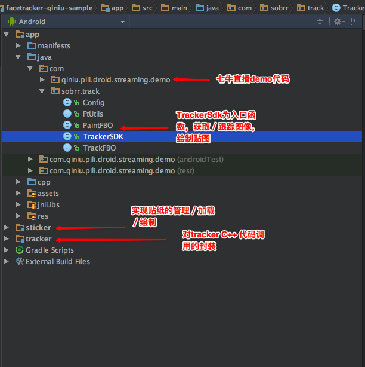

# trackerAndroidDemo

##trackerAndroidDemo是什么?

基于七牛直播SDK v2.1.1实现直播中多人脸track／多人脸动态贴纸的Android demo

##trackerAndroidDemo有哪些功能？

* 使用kiwi的`人脸跟踪库`，实现多人脸跟踪
* 在七牛直播中，根据人脸跟踪结果实现`人脸动态贴纸`
* 在七牛直播中，实现`哈哈镜`，`瘦脸`功能（即将提供）

##工程模块介绍

##KIWI Tracker

* 说明文档 
  FaceTracker人脸跟踪说明文档_v0.1.5.pdf
* 更多信息
  请联系[kiwi](http://kiwiapp.mobi/)

##七牛直播SDK

* [qiniu直播SDK DEMO](https://github.com/pili-engineering/PLDroidMediaStreaming)

##有问题反馈
在使用中有任何问题，欢迎反馈给我，可以用以下联系方式跟我交流

* github issue

##感激

* [qiniu直播](https://github.com/pili-engineering/PLDroidMediaStreaming) 
